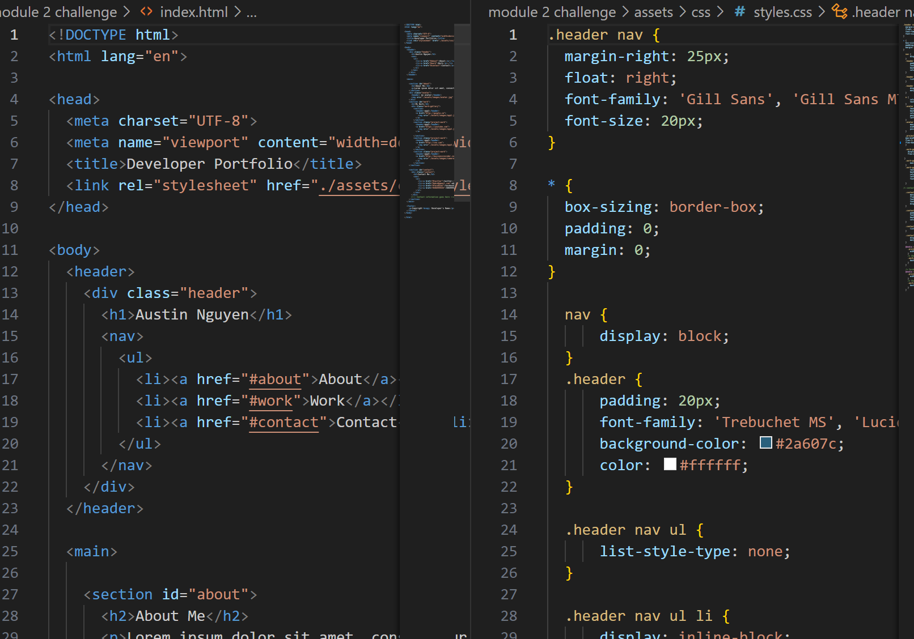

# module-2-challenge

# 

## Description

 create a website from scratch and follow the guidline below 

## Installation

N/A

## Usage
 
WHEN I load their portfolio
THEN I am presented with the developer's name, a recent photo or avatar, and links to sections about them, their work, and how to contact them
WHEN I click one of the links in the navigation
THEN the UI scrolls to the corresponding section
WHEN I click on the link to the section about their work
THEN the UI scrolls to a section with titled images of the developer's applications
WHEN I am presented with the developer's first application
THEN that application's image should be larger in size than the others
WHEN I click on the images of the applications
THEN I am taken to that deployed application
WHEN I resize the page or view the site on various screens and devices
THEN I am presented with a responsive layout that adapts to my viewport

Use the Acceptance Criteria as a guide for how you'll plan deadlines, sketch, and code your portfolio.

Ensure that your work meets the Acceptance Criteria and the full list of grading requirements.

Reach out to your instructional support team throughout the week for help.

Follow submission instructions.
## Note
asking help from tutor. He explains me how to put a text in the image.
asking askbcs about how to create a 2 column images and how to stack up images on each other. 

## Credits

N/A

## License

Please refer to the LICENSE in the repo.

## Screenshot
 

 ## URL link 
 https://github.com/AustinN789/module-2-challenge.git
 